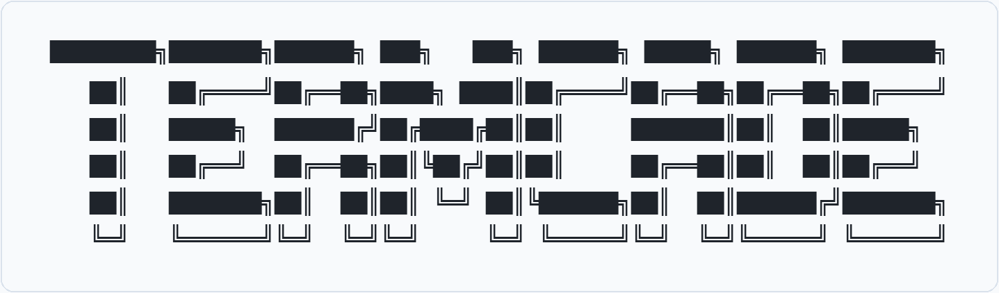

<div align="center">



### 装进口袋的终端街机厅

使用 Rust 和轻量级 `crossterm` 渲染器构建的终端游戏合集。
随时来一局，保存游戏记录，并积累共享的游戏钱包。

[English](README.md) · [한국어](README.ko.md) · [简体中文](README.zh-CN.md)

[](https://github.com/ium-mui/TERMCADE/actions/workflows/ci.yml)
[](https://github.com/ium-mui/TERMCADE/releases/latest)
[](LICENSE)

[安装](#安装) · [游戏](#游戏) · [操作](#操作) · [文档](#文档) · [参与贡献](#参与贡献)

</div>

## 安装

从[最新 GitHub Release](https://github.com/ium-mui/TERMCADE/releases/latest)下载适合你的压缩包，解压后将 `tcade`（Windows 为 `tcade.exe`）放入 `PATH`。每个版本都提供 SHA-256 校验和。

目前发布以下目标：

- Linux x86-64 和 ARM64
- macOS Intel 和 Apple Silicon
- Windows x86-64

如果已安装 Rust 1.85 或更高版本，可以直接从 GitHub 构建：

```bash
cargo install --git https://github.com/ium-mui/TERMCADE.git --locked
tcade
```

从本地仓库开发：

```bash
git clone https://github.com/ium-mui/TERMCADE.git
cd TERMCADE
cargo install --path . --locked
tcade
```

开发时也可以不安装直接运行：

```bash
cargo run --
cargo run -- math
cargo run -- snake classic-1
```

## 游戏

| 游戏 | 示例命令 | 目标 |
| --- | --- | --- |
| 心算 | `math` | 快速完成加减乘除 |
| 贪吃蛇 | `snake classic-1` | 避开墙壁和自己的身体生存下去 |
| 井字棋 | `tictactoe classic-1` | 在 3×3 棋盘上战胜电脑 |
| 2048 | `2048 classic-1` | 合并方块得到 2048 |
| 数独 | `sudoku classic-1` | 完成具有唯一解的数字谜题 |
| 扫雷 | `minesweeper beginner` | 避开地雷并揭开所有安全格 |
| 四子棋 | `connect-four easy` | 在分级 AI 前连成四枚棋子 |
| 记忆配对 | `memory small` | 记住卡片位置并找出所有配对 |
| 迷宫 | `maze alley` | 从新生成的迷宫中找到出口 |
| 赌场 | `gambling` | 游玩二十一点、轮盘、老虎机、AI 德州扑克和打字挖矿 |
| 打砖块 | `breakout classic-1` | 接住球并清除砖块 |

运行 `tcade` 可交互选择游戏和关卡，也可以直接指定：

```bash
tcade gambling blackjack-1
tcade gambling holdem-1
tcade minesweeper expert
tcade connect-four hard
tcade memory grand
tcade maze abyss
tcade snake turbo
tcade sudoku hard
```

## 操作

- 方向键，或游戏支持时使用 `W` `A` `S` `D`：移动
- `Enter`：选择、提交、翻开或执行主要操作
- `Space`：游戏特定的次要操作
- `Backspace`：删除数独数字
- `Esc` 或 `Q`：返回或离开游戏
- `Ctrl+C`：立即退出

扫雷使用 `F` 插旗。四子棋使用左右键选列。记忆配对使用 `Enter` 翻牌并确认错误配对。各赌场游戏会在界面上显示准确的下注和操作按键。

## 数据和终端要求

结果、历史和钱包余额以 JSON 保存到操作系统的应用数据目录。TERMCADE 不会静默覆盖损坏的历史文件。建议终端至少为 `64×24`，避免复杂棋盘被裁切。

## 文档

- [文档索引](docs/zh-CN/README.md)
- [游戏与关卡](docs/zh-CN/GAMES.md)
- [架构](docs/zh-CN/ARCHITECTURE.md)
- [开发指南](docs/zh-CN/DEVELOPMENT.md)
- [Issue、分支、提交与 PR 规则](docs/zh-CN/GIT_WORKFLOW.md)
- [发布与部署流程](docs/zh-CN/RELEASING.md)

## 参与贡献

欢迎各种贡献。请先阅读[贡献指南](docs/zh-CN/CONTRIBUTING.md)，在 Issue 中讨论重大变更，并在提交 PR 前运行 `./scripts/check.sh`。

少数安全相关 Bug 请参阅[安全说明](docs/zh-CN/SECURITY.md)。

## 许可证

TERMCADE 使用 [MIT 许可证](LICENSE)。
